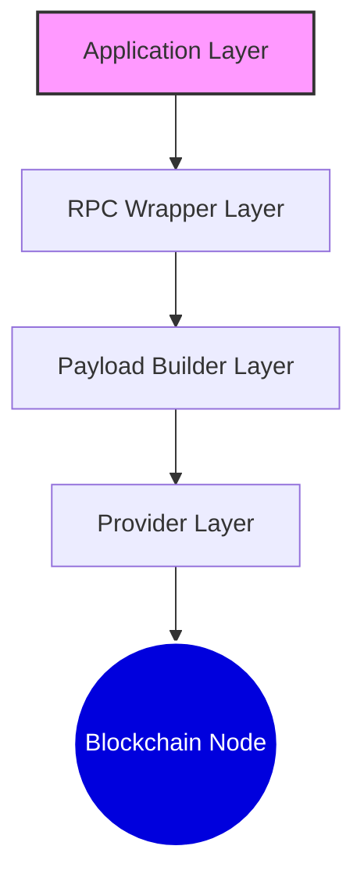

<h1 align="center">Client Blockchain RPC</h1>

<p align="center">
  <i>A professional, lightweight, and type-safe multi-protocol blockchain RPC client</i>
</p>

<p align="center">
  <a href="https://www.npmjs.com/package/client-blockchain-rpc">
    
  </a>
  <a href="https://www.npmjs.com/package/client-blockchain-rpc">
    
  </a>
  
  
</p>

---

## 📖 Introduction

**Client Blockchain RPC** is a high-performance, modular RPC client designed for developers who need a reliable way to interact with various blockchain protocols. Whether you are building a DeFi dashboard, a trading bot, or a cross-chain aggregator, this library provides a unified interface for **HTTP**, **WebSocket**, and **IPC** connections.

---

## 📦 Installation

```bash
# Using npm
npm install client-blockchain-rpc

# Using yarn
yarn add client-blockchain-rpc

# Using bun
bun add client-blockchain-rpc
```

---

## 🚀 Quick Start

### 1. High-Level RPC Wrappers

The easiest way to interact with a blockchain. Wrappers provide an intuitive, async/await interface for all standard methods.

#### Ethereum (EVM)

```typescript
import { Provider, EthereumRpc } from "client-blockchain-rpc";

const eth = new EthereumRpc(new Provider("https://eth.llamarpc.com"));

const blockNumber = await eth.blockNumber();
const balance = await eth.getBalance("0xd8dA...6045");
console.log(`Block: ${blockNumber}, Balance: ${balance} wei`);
```

#### Solana

```typescript
import { Provider, SolanaRpc } from "client-blockchain-rpc";

const solana = new SolanaRpc(
  new Provider("https://api.mainnet-beta.solana.com")
);

const balance = await solana.getBalance("vines1...7iY");
const version = await solana.getVersion();
console.log(`Balance: ${balance} lamports, Version: ${version["solana-core"]}`);
```

### 2. Using Providers & Payloads

For advanced usage, you can use the `Provider` directly with `Payload` builders. This is useful for custom formatting or manual request control.

```typescript
import { Provider, EthereumPayload as EIP } from "client-blockchain-rpc";

const provider = new Provider("wss://ethereum-rpc.publicnode.com");

// Use the payload builder directly
const chainId = await provider.send(EIP.chainId());
```

### 3. Reformatting Payloads

Sometimes you need a different return format than the default. You can use `PayloadHelper.reformat` to override the formatting logic of any payload.

```typescript
import {
  Provider,
  EthereumPayload as EIP,
  PayloadHelper,
} from "client-blockchain-rpc";

const provider = new Provider("https://eth.llamarpc.com");

// Default returns bigint
const blockNumber = await provider.send(EIP.blockNumber());

// Use reformat to get it as a string instead
const blockNumberStr = await provider.send(
  PayloadHelper.reformat(EIP.blockNumber(), (val) => val.toString())
);

console.log(typeof blockNumberStr); // "string"
```

### 4. Advanced Batch Requests

Execute multiple calls in a single network round-trip. The results are automatically parsed and typed.

```typescript
import { EthereumPayload as EIP } from "client-blockchain-rpc";

// Execute multiple requests at once
const [block, chainId] = await provider.sendBatch(
  EIP.blockNumber(),
  EIP.chainId()
);

block; <-- 1000000n
chainId; <-- 1n
```

### 5. WebSocket Subscriptions

Handle real-time events with automatic reconnection logic.

```typescript
import { EthereumPayload as EIP } from "client-blockchain-rpc";

provider.subscribe(
  EIP.subscribe("newHeads"),
  true, // autoReconnect
  (data, subsId) => {
    console.log(`New block in subscription ${subsId}:`, data.number);
  }
);
```

### 6. Custom Error Handling

Descriptively catch and handle RPC-level errors.

```typescript
try {
  await eth.getBalance("invalid-address");
} catch (error) {
  // Descriptive error message from the node
  console.error("RPC Error:", error);
}
```

---

## 🧩 Architecture

The library follows a layered architecture to ensure maximum flexibility and maintainability.



1. **Provider Layer**: Manages raw connections (HTTP/WS/IPC) and stateful features like auto-reconnect.
2. **Payload Builder Layer**: Pure, static functions that generate valid JSON-RPC request objects.
3. **RPC Wrapper Layer**: High-level instance methods that combine providers and payloads for a clean API.

---

## ⚙️ Configuration

The `Provider` constructor handles protocol detection and accepts optional settings.

```typescript
const provider = new Provider("wss://ethereum-rpc.publicnode.com", {
  reconnect: {
    autoReconnect: true,
    delay: 5000,
    maxAttempts: 10,
  },
  options: {
    // Protocol-specific options (web3-providers-ws, etc.)
  },
});
```

---

## 🧪 Testing

We ensure reliability through comprehensive unit and integration tests.

```bash
# Run the test suite
bun test
```

---

## 📜 License

Distributed under the **MIT License**.

---

<p align="center">
  Made with ❤️ by <a href="https://github.com/damartripamungkas">damartripamungkas</a>
</p>
